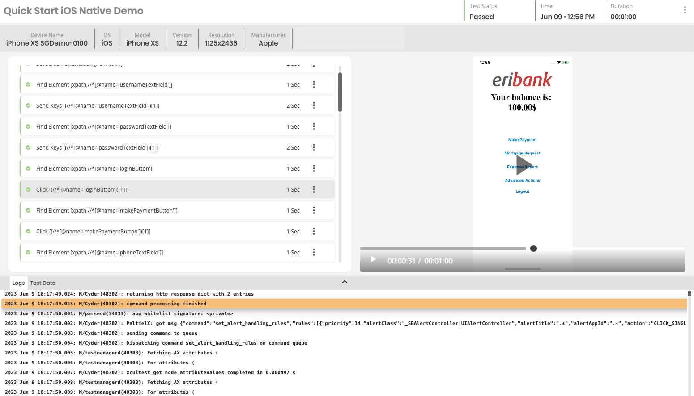
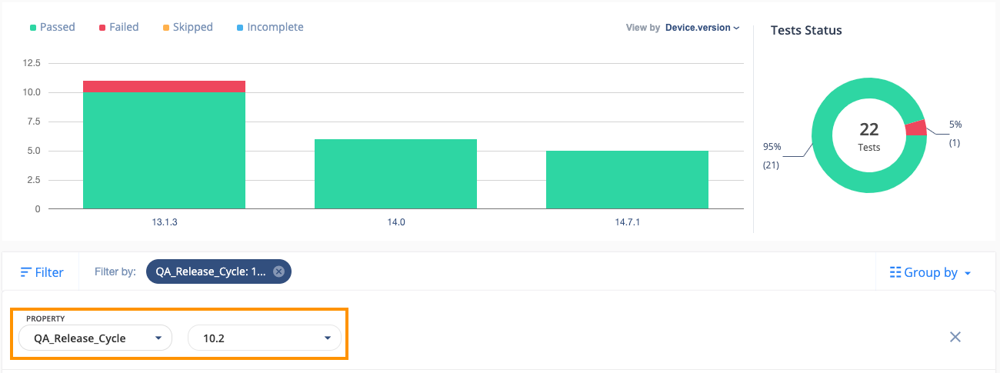

# DAI-CT-PremiumReporting

The purpose of this Code Repository is to show how we can improve Test Results capturing by implementing certain changes within your Automation Framework.

Digital.ai's Continuous Testing solution does a great job in capturing the Test Results by presenting visual data, such as Video, Test Steps and Device Logs:

But to ensure consistent reporting, adding a bit of code would further improve the Test Results by accurately capturing the Test Result State (Passed or Failed), as well as adding custom filter sets, allowing for easier viewing of Reports after you have executed all your Tests:

